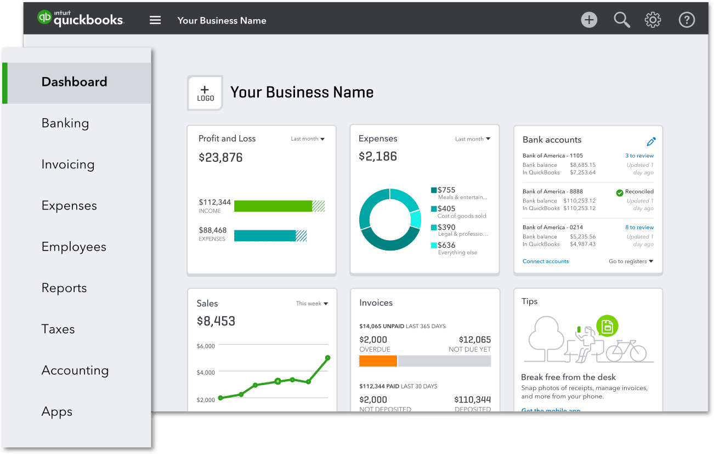
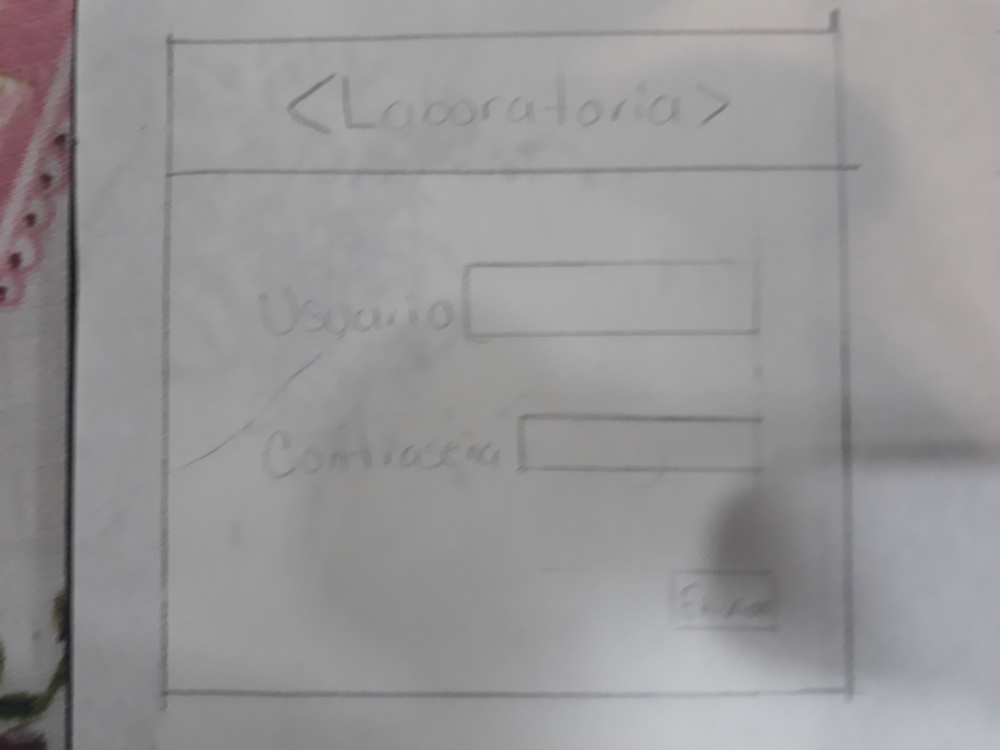
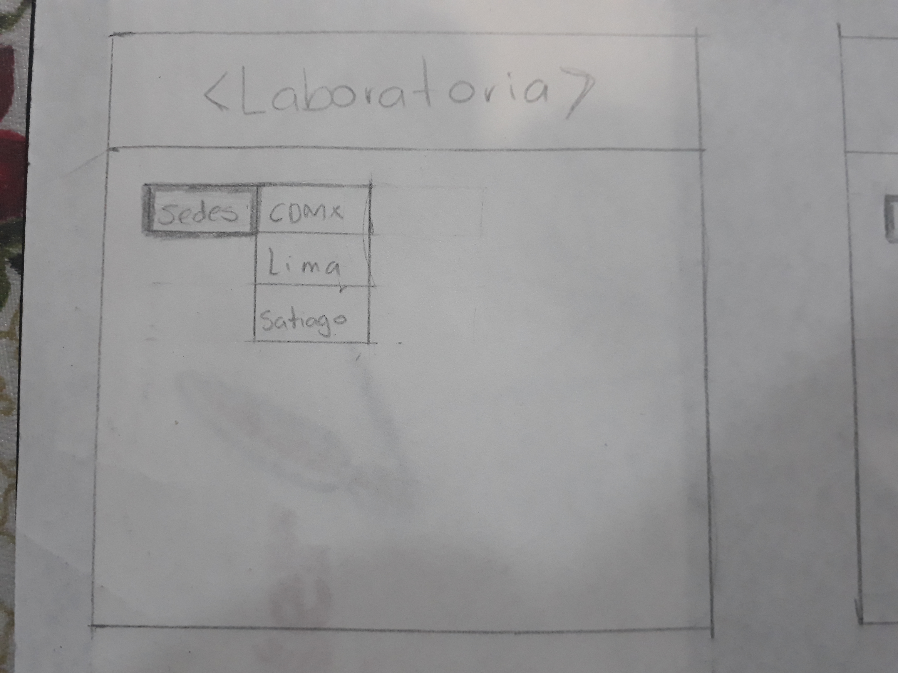
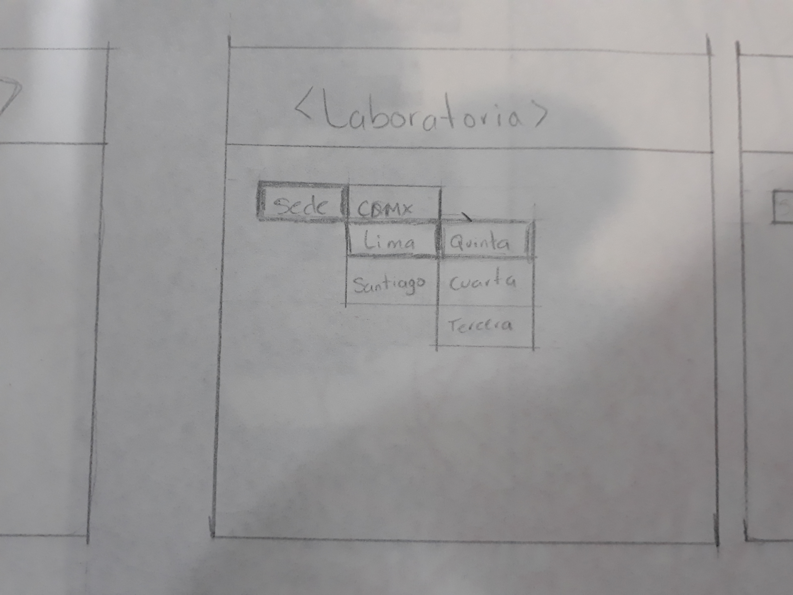
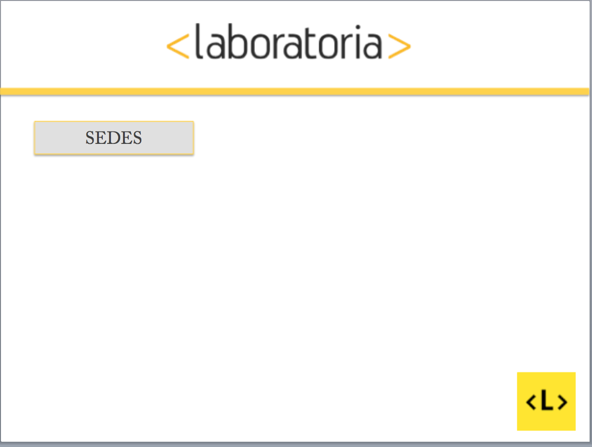
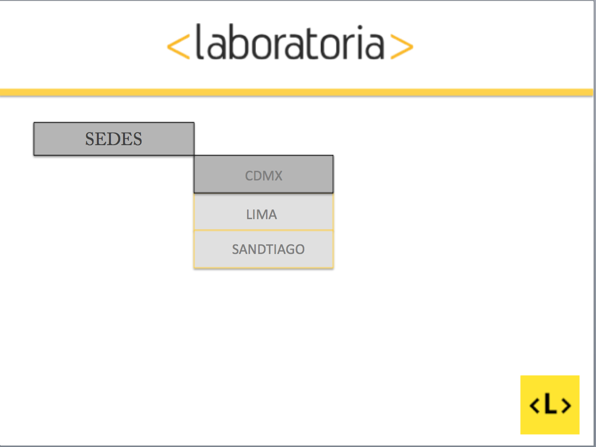
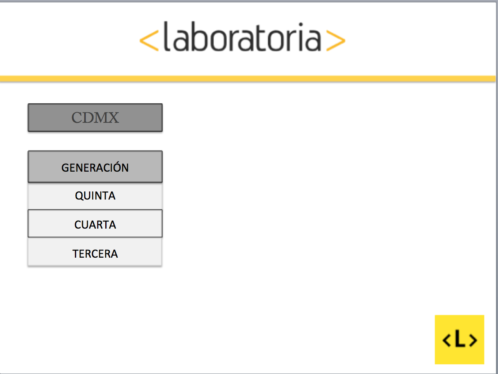
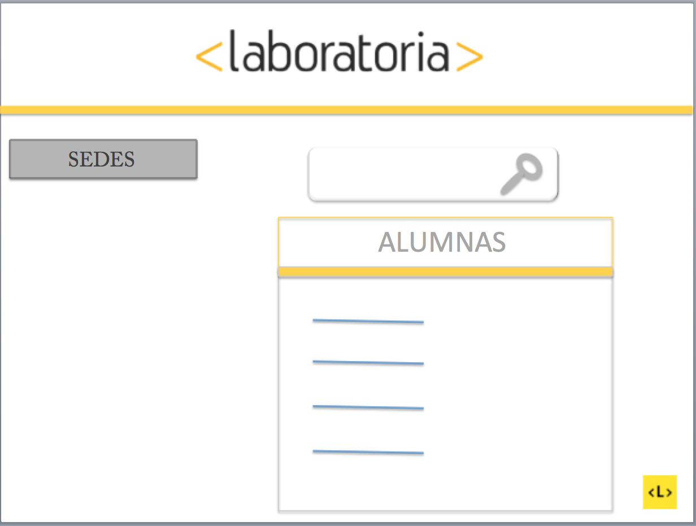

# DATA DASHBOARD
----

## ** README UX**
----

> En este espacio describiremos como fue nuestro acercamiento con el proceso de UX durante
el desarrollo del proyecto de **data dashboard**.
----

### ¿Qué es un **data dashboard**?

Un **data dashboard** es una herramienta para las empresas que analizan información, la cual representa de manera visual y gráfica mediante el uso de los *KPI's* las principales métricas, que intervienen en la adquisición de los objetivos de una estrategia. Sirve para recolectar **data** en una organización, además de brindar información clave sobre el comportamiento del mercado y de los usuarios que pueden ser posibles clientes, esto ayuda a la organización a la hora de la toma de desiciones.

> Beneficios de su uso 

    * Permite visualizar errores en las organizaciones.

    * Facilita la toma de desiciones.

    * Monitorea la estrategia planteada. 

    * Reporta las acciones y los resultados generados.

    * Delimita estrategias y objetivos organizacionales.

**Sitemas ya existentes de dashboard**

Algunas de las referencias que encontramos que nos podian servir de ejemplo fueron: 

* Google Analytics
[Google Analytics](https://www.google.com/intl/es_ALL/analytics/features/index.html)

* Instituto Politécnico Nacional
**Ete sitio solo esta abierto durante la temporada de exámenes de admisión**
[IPN](http://www.ipn.mx/ofertaeducativa/Paginas/Estadisticas.aspx)

* Mailchimp
[Mailchimp](https://blog.mailchimp.com/new-list-dashboard/)

* Quickbooks
[Quickbooks](https://quickbooks.intuit.com/reporting/)

----

### Objetivos

* Desarrollar un proyecto en el cual se impletente una interfaz con una usuabilidad fácil de manejar, y con la que las Training Managers puedan obtener más fácilmente los datos que necesiten de las alumnas.

* Conocer más acerca del proceso de UX, durante el desarrollo del proyecto de data dashboard se implementara User Experience, obteniendo inforación del usuario atraves de la investigación(entrevistas).

###Objetivo especifico

* Crear durante el tiempo de desarrollo de este proyecto una interfaz sencilla, de manera de que la interacción en la busqueda de la información sobre las estudiantes sea menos complicado.
----

### Proceso

* ### Obtención de datos
Cuando se nos entregaron los requerimientos del proyecto de **data dashboard**, lo primero que pensamos que deberiamos hacer fue en un acercamiento, mediante una entrevista a la Training Manager de nuestra sede México (Lucile). Esto para conocer mejor, el por que las Training Managers requieren manejar data, y como seria el diseño e implementación de la mejor solución que nosotros pudieramos ofrecerles.

Por otra parte, también buscamos referencias de otros sistemas de manejo de data(incluidos en el readme de los requerimientos del proyecto), para poder darnos ideas de como esos sistemas visualizan su data.

> *Acontinuación desplegaremos las preguntas que diseñamos para la entrevista con nuestra Training Manager*

    ***CUESTIONARIO***

    1. ¿Qué tipo de sistema de manejo de data utilizan actualmente?

    2. ¿Cómo es el proceso actual del manejo de data?

    3. ¿Por qué es importante el manejo de data para las Training Manager?

    4. ¿Qué tan seguido utilizas el sistema para visualizar el avance de las alumnas?

    5. ¿Qué tipo de dispositivo utilizas lap,celular o tableta para checar la data?

    6. ¿Qué tipo de informaión te gustaría que se visualizara?

    7. ¿Qué tipo de gráfica te gustaría que se pusieran?

    8. Además de las Training Manager,¿quién más del equipo de laboratoria usa esta data?   

***Nota*** Además de nuestra entrevista con la Training Manager de México(Lucile), gracias a nuestra compañeras logramos obtener las entrevistas de Training Manager de otras sedes.
----

### Necesidades del usuario

Con la información obtenida en la entrevista, hemos podido darnos cuenta de que no solamente son lxs Training Manager, quienes tienen acceso a la información de las estudiantes, sino que es todo el equipo de laboratoria quien tiene el acceso a está información, para seguir el desempeño decada una ellxs; además de que nos mencionaron la importancia para ellos, de la utilización de un visualizador de datos, ya que actualmente laboratoria no cuenta con uno, y usan formato de excel para su visualización, y el proceso para la obtención de los datos en este formato es muy largo. Por este motivo les seria más eficaz un data dashboard. 

 > ***Ultilidad del data dashboard***
    1. Visualizar los datos de las estudiantes de una manera más rápida.
    2. Comparar el rendimiento de las estudiantes en su desempeño durante el Bootcamp.
    3. Comparar la eficacia de los métodos utilizados entre las sedes.
    4. Visualizar los inidcadores cuando algunos métodos no estén funcionando, para poder realizar los cambios oportunamente.
----

### Planificación

Ahora que hemos tenido un acercamiento con el usuario, y obtuvimos los datos que necesitamos por ahora, podemos comenzar un filtro, y asi poder ver que priorizar y que poder dejar para hacer después de que las actividades priorizadas estes hechas, comenzamos con un prototipado de como queremos que sea nuestra interfaz(baja fidelidad), que es el sketch. En este pondremos lo que nosotras, con la obtención de datos ya pasados por nuestros filtros, la que será la mejor solución.

> ***Filtro***
    * Mostrar los datos de la generación actual.
    * Mostrar su rendimiento.
    * No importa si no tiene gráficas, que sea algo más númerico para visualizar
    * Mostrar las alumnas de otras sedes.

***Prototipos***

*  ***Sketch*** (baja fidelidad)

Con los datos que logramos obtener, a través de la entrevista logramos hacer un diseño(baja fidelidad), por el cual nos podemos guiar para comenzar a trabajar.

 ***Nota*** Con las respuestas obtenidas durante la entrevista con nuestra Training Manager, y las adqueridas de otros Training Managers, decidimos que un diseñamos con una interfaz sencilla y fácil de utilizar sería lo más adecuado(durante el proceso de implementación también se podrían relaizar cambios en el diseño).  

* ### Diseño(Alta fidelidad)
Teniendo encunta los sketch de baja fidelidad se crearon los sketch de alta fidelidad, utilizando los colores emrpesariales asi como la sencilles que piden las TM para poder accesar al data dashboard.

* ### Sketch (alta fidelidad)
 

 >Nuestra primera vista, es un formulario de acceso para evitar que cualquier otra persona que no sea del equipo de laboratoria, tenga acceso a la informacion de las alumnas.

 

 >En la segunda vista colocamos los botones despegables para que puedan filtrar que sede y generaciones desean consultar.

 

>En esta vista, mostramos como sera el despegable de sedes.

 

>En la cuarta vista, enseñamos como sera el despegable de generaciones.Tanto el botón de sedes y generaciones esta posicionado en el lado superior izquierdo para que el despliegue de los datos,tenga espacio para mostrarse.

 

>En la ultima vista mostramos, en que parte vamos a mostrar los datos y como queremos que se visualizen. El botón de sedes y generación, permaneceran visibles, para que sea más práctico el moviento de la visualización de los datos.